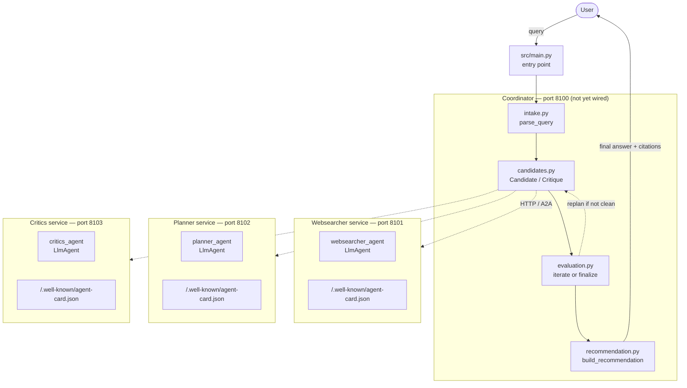

# A2A Architecture Overview — Deep Search Agent System

## Summary

This system splits into two layers that run as separate processes. The **network layer** is A2A (Agent2Agent): each specialist — Websearcher, Planner, Critics — runs as its own HTTP service with an auto-generated agent card, and the Coordinator reaches them as remote agents over `localhost`, not as in-process Python calls. The **orchestration layer** is plain Python inside the Coordinator (`intake.py`, `candidates.py`, `evaluation.py`, `recommendation.py`) that decides *when* to call each specialist and *when to stop iterating*. Right now, the three specialists are exposed and running (ports 8101–8103); the Coordinator's orchestration logic exists as standalone files but isn't yet wired to call the specialists over A2A or exposed as its own service — that wiring, plus `src/main.py` launching everything together, is what Phase 5 still needs.

---

## Diagram

Dotted lines mark real network calls (A2A over HTTP) — everything inside the `Coordinator` box is a single Python process; everything in `WS`/`PL`/`CR` is a *separate* process, started independently via `uvicorn`.

---

## Component breakdown (current state)

| Component | File(s) | Port | Status |
|---|---|---|---|
| Websearcher agent | `agents/websearcher/websearcher.py` | — | Built (Phase 2) |
| Websearcher A2A service | `agents/websearcher/server.py` | 8101 | Running (`to_a2a()`) |
| Planner agent + service | `agents/planner/planner.py`, `server.py` | 8102 | Running |
| Critics agent + service | `agents/critics/critics.py`, `server.py` | 8103 | Running |
| Coordinator pipeline | `agents/coordinator/{intake,candidates,evaluation,recommendation}.py` | — | Logic exists, **not yet calling A2A** |
| Coordinator agent/service | `agents/coordinator/agent.py` + a `server.py` on 8100 | 8100 | **Not built yet** |
| Entry point | `src/main.py` | — | **Not wired (Phase 5)** |

Each specialist's `server.py` follows the same one-line pattern — `to_a2a(<agent>, port=<port>)` — which wraps the `LlmAgent` from the sibling `<name>.py` file into a Starlette app and auto-generates its agent card from that agent's `name`/`description`/`instruction`.

The Coordinator's four files currently operate as a **standalone, locally-testable pipeline** (each runnable with `uv run python agents/coordinator/<file>.py`, per the `docs/` practice versions). What's missing is the step where `candidates.py` (or a new `agent.py`) actually reaches out over HTTP to `localhost:8101/8102/8103` instead of taking hand-built `Candidate`/`Critique` objects as in the practice examples.

---

## Two layers, two kinds of bugs

It's worth keeping these mentally separate, because they fail differently:

- **Network layer (A2A)** — fails with things like `ConnectionRefusedError`, a missing or generic agent card, or a wrong port. You debug this with `curl http://localhost:810X/.well-known/agent-card.json` and by checking the specialist's `<name>.py` for a missing `description=`.
- **Orchestration layer (Coordinator pipeline)** — fails with things like an infinite revision loop, a `Critique` that never satisfies `is_clean()`, or citations missing from the final answer. You debug this with the `__main__` blocks already in each `docs/` example file, no network involved.

A failure in one layer rarely explains a symptom in the other — if `evaluate()` keeps looping, the fix is in `evaluation.py`'s thresholds, not in any port number.

---

## Follow-up questions

1. The Coordinator pipeline currently takes hand-built `Candidate` objects in its `__main__` blocks. What's the smallest change to `candidates.py` that would make it call the real Websearcher/Planner/Critics services instead — a new function, or a change to an existing one?
2. Does the Coordinator itself need to be exposed via `to_a2a()` on port 8100, or could `src/main.py` just call the Coordinator's pipeline functions directly in-process and skip giving the Coordinator its own agent card? What would you lose by skipping it?
3. Looking at the diagram, the dotted A2A lines all originate from `candidates.py`. Is that the right place for them to live, or should the HTTP calls move into `intake.py` (for Websearcher) and stay separate from the Planner/Critics calls in `candidates.py`?
