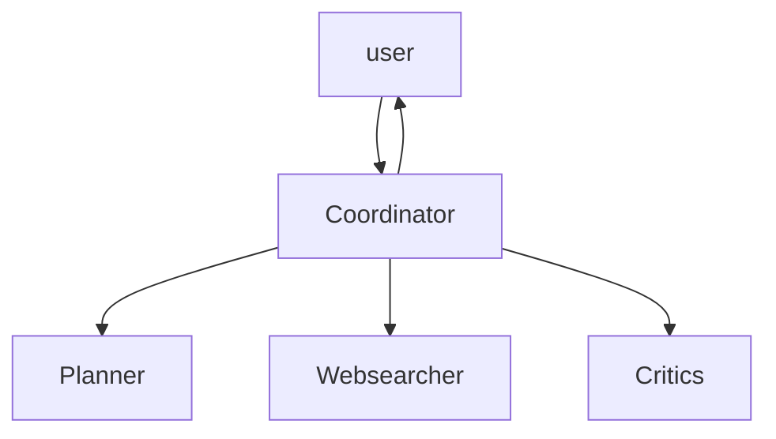

# Deep Search Agents Logic

## Agents

- Coordinator
  - Does the final decision based on the opinions of the Planner and Critics

- Planner
  - Creates the inital answer to user's query

- Critics
  - Critically evaluates the output of the planner

- Websearcher
  - Give necessary background information for the other three

## State Transition and Data Flow



## Directory Architecture

```text
src/
  |__main.py
agents/
  |__coordinator
    |__coordinator.py
  |__websearcher
    |__websearcher.py
  |__planner
    |__planner.py
  |__critics
    |__critics.py
  |__tools.py
```
