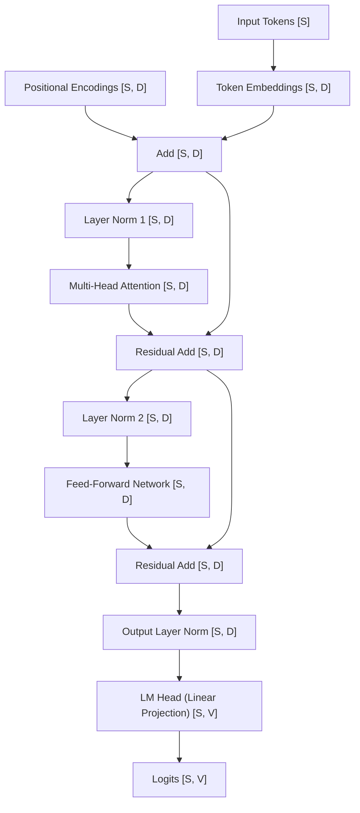

# Implementation Plan - Minimum Viable Transformer in Rust

This document details the step-by-step plan to implement a Minimum Viable Transformer (最小限の実用可能なトランスフォーマー) model from scratch in Rust using the `ndarray` crate. This will be a decoder-only (デコーダーのみ) model similar to the GPT architecture.

---

## User Review Required

> [!IMPORTANT]
> - We will use the `ndarray` crate (多次元配列用クレート) for linear algebra calculations to keep memory layouts explicit and lightweight.
> - The model will implement the forward pass (順伝播) and basic tensor operations. Backpropagation (逆伝播) is omitted in this minimum viable version to focus on architecture and tensor shapes, but we can extend it later if desired.
> - You will need to run the commands in your terminal at each phase.

---

## Key Concepts & Tensor Shapes

To understand the calculations, we track the shapes of vectors and matrices at each stage.
Let the model configuration be defined by:
- $B$: Batch Size (バッチサイズ) = 1 (simplified for this walkthrough)
- $S$: Sequence Length (シーケンス長)
- $D$: Model Dimension (モデルの次元数) (`d_model`)
- $H$: Number of Attention Heads (アテンションヘッド数) (`n_heads`)
- $D_k$: Head Dimension (ヘッドの次元数) = $D / H$ (`d_head`)
- $V$: Vocabulary Size (語彙数) (`vocab_size`)

Here is a summary of the tensor transformations during the forward pass:



---

## Proposed Changes

We will create a new Rust binary package inside the `LLM` directory.

### [Component Name] Minimum Transformer Package

#### [NEW] [Cargo.toml](file:///d:/Training/AI-Basics/LLM/rust-transformer/Cargo.toml)
Defines project metadata and dependencies.
- **Dependencies**: `ndarray` for multidimensional array calculations, `rand` for random initialization.

#### [NEW] [src/main.rs](file:///d:/Training/AI-Basics/LLM/rust-transformer/src/main.rs)
The entry point of our Rust program to test the forward pass of the model.

#### [NEW] [src/config.rs](file:///d:/Training/AI-Basics/LLM/rust-transformer/src/config.rs)
Holds model configuration parameters.

#### [NEW] [src/ops.rs](file:///d:/Training/AI-Basics/LLM/rust-transformer/src/ops.rs)
Utility functions for activation functions like Softmax (ソフトマックス関数) and GELU (GELU活性化関数).

#### [NEW] [src/layers.rs](file:///d:/Training/AI-Basics/LLM/rust-transformer/src/layers.rs)
Contains implementations of:
- **Embedding** (埋め込み層)
- **PositionalEncoding** (位置エンコーディング)
- **MultiHeadAttention** (マルチヘッド自己注意機構)
- **FeedForward** (順伝播型ネットワーク)
- **LayerNorm** (レイヤー正規化)

#### [NEW] [src/model.rs](file:///d:/Training/AI-Basics/LLM/rust-transformer/src/model.rs)
Assembles individual layers into a `TransformerBlock` and the final `Transformer` model.

---

## Detailed Step-by-Step Phases

The implementation will be completed in the following phases. At each phase, you will execute cargo commands or review code:

### Phase 1: Initialize Project & Setup Cargo
- **Goal**: Create a new Cargo package and configure `Cargo.toml`.
- **What you will do**: Run the commands to initialize the project and check that dependencies compile successfully.

### Phase 2: Configuration & Mathematical Operations
- **Goal**: Define `Config` and custom mathematical operations like softmax along the last axis.
- **What you will do**: Write code in `src/config.rs` and `src/ops.rs`. Softmax is calculated as:
  \[
  \text{Softmax}(x_i) = \frac{e^{x_i - \max(x)}}{\sum_j e^{x_j - \max(x)}}
  \]
  This stable softmax prevents numerical overflow (数値オーバーフロー).

### Phase 3: Implement LayerNorm & FeedForward layers
- **Goal**: Implement standard utilities for neural networks.
  - **LayerNorm (レイヤー正規化)**: Normalizes input over the features dimension $D$.
    \[
    y = \frac{x - \mu}{\sqrt{\sigma^2 + \epsilon}} \gamma + \beta
    \]
  - **FeedForward (順伝播型ネットワーク)**: A two-layer linear network with a GELU or ReLU activation.
    - Linear 1 weight shape: `[D, d_ff]`
    - Linear 2 weight shape: `[d_ff, D]`
    - Output shape: `[S, D]`

### Phase 4: Implement Embeddings & Positional Encoding
- **Goal**: Add token embedding mapping and sinusoidal positional encoding.
  - **Token Embedding (トークン埋め込み)**: Lookup table of shape `[V, D]`. Maps token index to vector.
  - **Positional Encoding (位置エンコーディング)**: Adds wave-like positional biases of shape `[S, D]`.
    \[
    PE_{(pos, 2i)} = \sin\left(\frac{pos}{10000^{2i/D}}\right), \quad PE_{(pos, 2i+1)} = \cos\left(\frac{pos}{10000^{2i/D}}\right)
    \]

### Phase 5: Implement Multi-Head Self-Attention
- **Goal**: Implement causal self-attention.
  - Linear projections for Query (クエリ) $Q$, Key (キー) $K$, Value (値) $V$.
    - Weights shape: `[D, D]` for each projection.
    - Projections yield matrices of shape `[S, D]`.
  - Split into $H$ heads of size $D_k$: Reshape from `[S, D]` to `[S, H, D_k]`, and transpose to `[H, S, D_k]`.
  - Calculate attention weights matrix of shape `[H, S, S]`:
    \[
    A = \text{Softmax}\left(\frac{Q K^T}{\sqrt{D_k}} + M\right)
    \]
    Where $M$ is the causal mask (因果マスク) having $-\infty$ on upper-triangle elements to prevent looking at future tokens.
  - Multiply weights by values: $A \cdot V$, resulting in shape `[H, S, D_k]`.
  - Transpose and reshape back to `[S, D]`.
  - Apply output projection of shape `[D, D]`.

### Phase 6: Model Assembly
- **Goal**: Group attention and feedforward into a `TransformerBlock` and combine multiple blocks with an output projection layer to produce logits of shape `[S, V]`.

### Phase 7: Verification Run
- **Goal**: Build and run the program, executing a forward pass with dummy token inputs and printing output logits.

---

## Verification Plan

### Automated Tests
Once the code is implemented, we will run:
```powershell
cargo check
cargo run
```

### Manual Verification
- We will verify that the output shape of our model's forward pass is exactly `[seq_len, vocab_size]`.
- We will inspect output probability scores to ensure causal masking works (i.e. changing future tokens does not affect current token outputs).
