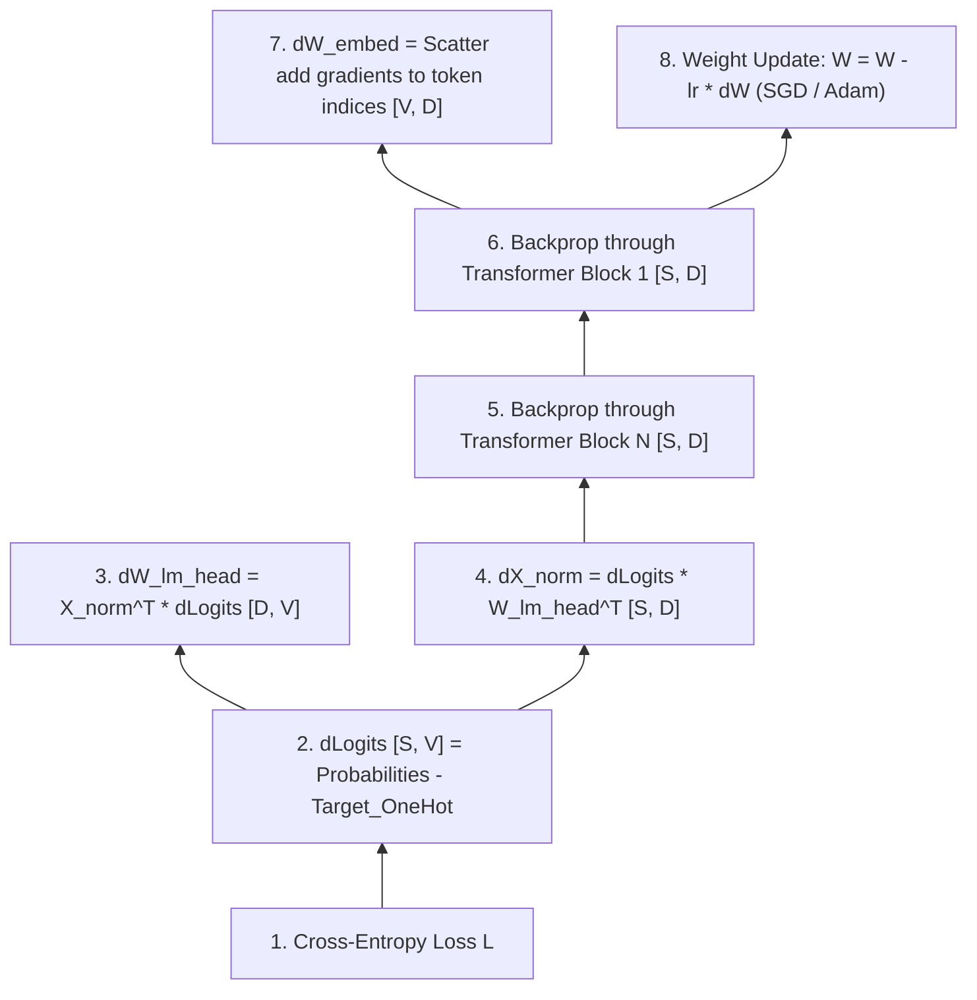

# Implementation Plan - Transformer From-Scratch Training & Persistence in Rust

This document details the step-by-step implementation plan to pre-train our Minimum Viable Transformer using **pure Rust manual backpropagation from scratch (ndarray)** on a **Modern English dataset** and persist (save/load) model parameters.

---

## Key Decisions (User Preferences Incorporated)

> [!IMPORTANT]
>
> 1. **Backpropagation Engine**: **Option B (Pure Rust `ndarray` from-scratch backprop)**.
>    - We will manually derive and code the analytical gradients for Softmax, Cross-Entropy, LayerNorm, Feed-Forward, Multi-Head Attention, and Embeddings.
>    - This gives maximum educational insight into the internal calculus of Transformer training.
> 2. **Dataset Choice**: **Modern English Corpus** (`modern_english_corpus.txt`).
>    - We will use a clean Modern English text corpus (e.g., Simple English Wikipedia / Modern short stories) so the model learns contemporary vocabulary, grammar, and sentence structures.
> 3. **Hardware Execution**: **Standard CPU Execution**.
>    - No complex GPU or CUDA toolchain setup required. Clean, platform-independent Rust code.
> 4. **Model Persistence**: **Serde + Bincode (`.bin`)**.
>    - Save and reload model weights and hyperparameters to disk using `serde` serialization.

---

## 🧮 Backpropagation Math & Tensor Shapes

We will implement manual gradient calculations ($\nabla L$) flowing backward from the Loss to the Embeddings:



### Gradients Breakdown

1. **Cross-Entropy + Softmax Gradient**:
   \[
   \frac{\partial L}{\partial \text{logits}_{i,j}} = P_{i,j} - \mathbb{I}(j = y_i) \quad \text{Shape: } [S, V]
   \]
2. **LM Head Weights Gradient**:
   \[
   \nabla W_{lm\_head} = X_{norm}^T \cdot d\text{Logits} \quad \text{Shape: } [D, S] \times [S, V] \to [D, V]
   \]
3. **LayerNorm Backward Pass**:
   Calculates gradients for scale $\gamma$, shift $\beta$, and input $X$.
4. **Feed-Forward Network Backward Pass**:
   - $\nabla W_2, \nabla b_2$ for second linear layer.
   - GELU derivative: $\frac{d}{dx}\text{GELU}(x)$.
   - $\nabla W_1, \nabla b_1$ for first linear layer.
5. **Multi-Head Attention Backward Pass**:
   - Gradients flowing through attention weights $A$, query $Q$, key $K$, value $V$, and projections $W_q, W_k, W_v, W_o$.
6. **Embedding Gradient**:
   - Accumulate gradients for each looked-up token index into $W_{embed}$.

---

## Proposed Changes

We will modify and add the following components in `LLM/rust-transformer`:

### [Component Name] From-Scratch Training & Persistence Package

#### [MODIFY] [Cargo.toml](file:///d:/Training/AI-Basics/LLM/rust-transformer/Cargo.toml)

Add `serde` and `bincode` for binary weight persistence.

#### [NEW] [data/modern_english.txt](file:///d:/Training/AI-Basics/LLM/rust-transformer/data/modern_english.txt)

A clean dataset of Modern English sentences and paragraphs.

#### [NEW] [src/dataset.rs](file:///d:/Training/AI-Basics/LLM/rust-transformer/src/dataset.rs)

Dataset loader that reads `modern_english.txt`, tokenizes text, and generates input-target sequence pairs for next-token prediction:

- Input $X$: Token IDs at positions $[0 \dots S-1]$
- Target $Y$: Token IDs at positions $[1 \dots S]$

#### [NEW] [src/autograd.rs](file:///d:/Training/AI-Basics/LLM/rust-transformer/src/autograd.rs)

Contains analytical gradient functions for:

- `softmax_cross_entropy_backward`
- `layer_norm_backward`
- `gelu_backward`
- `linear_backward`
- `attention_backward`

#### [NEW] [src/optimizer.rs](file:///d:/Training/AI-Basics/LLM/rust-transformer/src/optimizer.rs)

Implements Stochastic Gradient Descent (SGD) and Adam optimizer with momentum in pure Rust.

#### [NEW] [src/checkpoint.rs](file:///d:/Training/AI-Basics/LLM/rust-transformer/src/checkpoint.rs)

Implements saving model configuration and parameters to `model_weights.bin` and reloading them.

#### [NEW] [src/bin/train.rs](file:///d:/Training/AI-Basics/LLM/rust-transformer/src/bin/train.rs)

Training binary that runs the loop, prints loss reduction step-by-step, saves checkpoints, and generates text!

---

## Detailed Step-by-Step Phases

### Phase 1: Prepare Modern English Dataset & Cargo Dependencies

- Add `serde` and `bincode` to `Cargo.toml`.
- Create `data/modern_english.txt` containing modern English sentences.
- Implement dataset loading and sequence pairing in `src/dataset.rs`.

### Phase 2: Implement Analytical Gradients (`src/autograd.rs`)

- Write and unit-test backward functions for Softmax, Linear layers, GELU, and LayerNorm.

### Phase 3: Implement Optimizer & Layer Backward Methods

- Add `.backward()` methods to `LayerNorm`, `FeedForward`, `MultiHeadAttention`, and `Transformer`.
- Implement `Optimizer` struct in `src/optimizer.rs` to update weights: $W \leftarrow W - \eta \cdot \nabla W$.

### Phase 4: Implement Weight Persistence (`src/checkpoint.rs`)

- Derive `Serialize` and `Deserialize` for model weight structures.
- Implement `save_model(&transformer, "model_weights.bin")` and `load_model("model_weights.bin")`.

### Phase 5: Build Training Binary & Verify Text Generation (`src/bin/train.rs`)

- Run the training loop for 200-500 steps on `modern_english.txt`.
- Verify that average loss decreases significantly (e.g. from $> 5.5$ down to $< 1.5$).
- Save the trained checkpoint `model_weights.bin`.
- Reload the checkpoint and generate text from a prompt like `"the model is"` to see modern English text generation in action!

---

## Verification Plan

### Automated Tests

Run unit tests for backward gradients and weight persistence:

```powershell
cargo test
```

### Manual Verification

Run the training binary:

```powershell
cargo run --bin train
```

Verify:

1. Training loss decreases step-by-step on Modern English text.
2. Checkpoint `model_weights.bin` is generated on disk.
3. Loading `model_weights.bin` produces coherent Modern English predictions.
