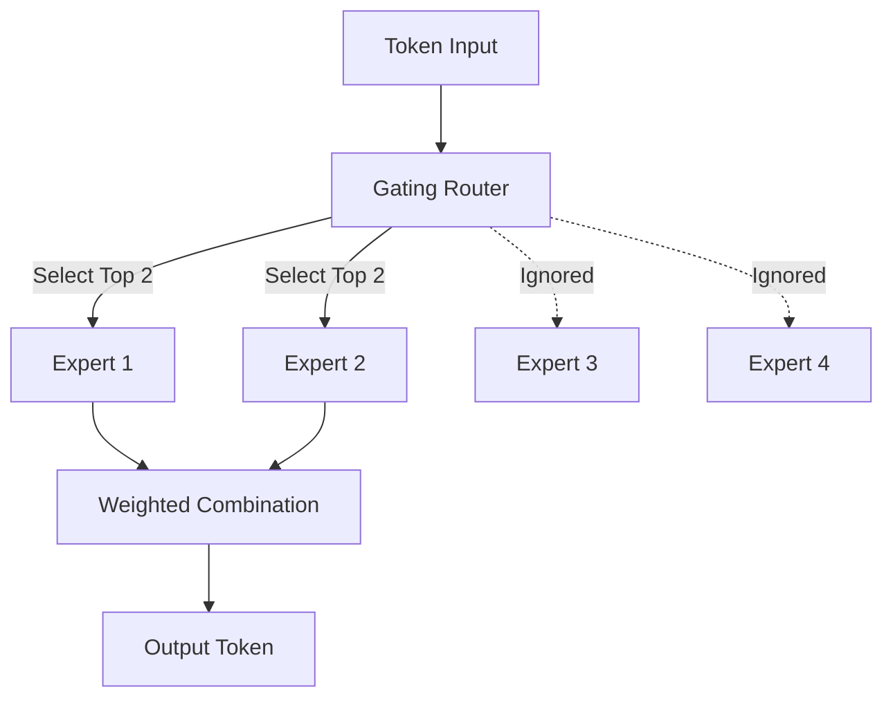

# AI Basics & Mixture of Experts (MoE) Practice

This repository is dedicated to advanced AI foundations, featuring a minimum viable implementation of a **Sparse Mixture of Experts (MoE)** language model based on the GPT-2 architecture.

It demonstrates custom **Top-K Routing**, token dispatch logic, and FFN (Feed-Forward Network) layer injection techniques, optimized for fast and clean local execution.

---

## 🚀 Environment Setup via `uv`

We use **[uv](https://github.com/astral-sh/uv)**, an extremely fast Python package installer and resolver written in Rust. It serves as a modern replacement for `pip`, `pip-tools`, and `virtualenv`.

### Prerequisites

- Python >= 3.9
- `uv` installed on your local machine.
  - **macOS/Linux**:

    ```bash
    curl -LsSf https://astral.sh/uv/install.sh | sh
    ```

  - **Windows (PowerShell)**:

    ```powershell
    powershell -c "irm https://astral.sh/uv/install.ps1 | iex"
    ```

---

### Step-by-Step Installation

Follow these simple steps to set up your isolated development environment:

#### 1. Clone & Navigate to the Repository

```bash
git clone <your-repository-url>
cd AI-Basics
```

#### 2. Create the Virtual Environment

Using `uv`, creating a virtual environment is near-instantaneous:

```bash
uv venv
```

This creates a `.venv` directory in the project root.

#### 3. Activate the Environment

- **Windows (Command Prompt / PowerShell)**:

  ```powershell
  .venv\Scripts\activate
  ```

- **macOS / Linux**:

  ```bash
  source .venv/bin/activate
  ```

#### 4. Sync Dependencies

Because this repository is packaged with a modern `pyproject.toml` and lockfile (`uv.lock`), you can install all necessary packages (including `transformers`, `datasets`, `accelerate`, and `torch`) in seconds:

```bash
uv sync
```

*Alternatively, if you prefer to run scripts without manually activating the virtual environment, you can prefix commands with `uv run` (e.g., `uv run python LLM/MoE-antigravity.py`).*

---

## 📂 Project Structure

```text
├── .venv/                     # Managed virtual environment
├── LLM/
│   ├── mixture-of-experts.py  # Reference script for model loaders & baseline NLP
│   └── MoE-antigravity.py     # Custom Top-K Sparse MoE layer implementation
├── specs/
│   └── mixture-of-experts.md  # Training specifications and requirements
├── pyproject.toml             # Project dependency configuration
├── uv.lock                    # Dependency lockfile
└── README.md                  # Project documentation (this file)
```

---

## 🛠️ Usage

### Training the MoE Model

To train the customized GPT-2 MoE model (with Top-2 routing and 4 total experts per layer) on 1% of the Wikitext-2 corpus, run:

```bash
uv run python LLM/MoE-antigravity.py
```

This script will:

1. Initialize the baseline pretrained GPT-2 model.
2. Dynamically replace all internal MLPs with our custom `SparseMoELayer`.
3. Load, tokenize, and format the Wikitext-2 raw dataset.
4. Execute a lightweight training run using Hugging Face's `Trainer`.

---

## 💡 Concept Overview

### Top-K Routing

Rather than passing a token through all parameters (which is computationally prohibitive), a linear **Gating Router** evaluates token features and directs them to the top `K` most compatible **FFN Experts**:



This sparse computation lets us scale parameters and representation capacity without a corresponding increase in latency!
